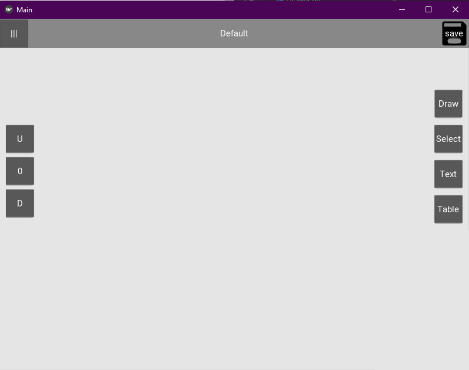

# Innoter
This is an project of Intelligent, Intuitive Noter (WhiteBoard). Uses Machine Learning to interpret what user meant to draw and translate it into beautiful diagrams, boxes, etc.

## Table of contents
* [General info](#general-info)
* [Screenshots](#screenshots)
* [Technologies](#technologies)
* [Setup](#setup)
* [Features](#features)
* [Status](#status)
* [Contact](#contact)

## General info
I love to create, plan and build concepts. One of my favorite tools is whiteboard and loads of colorfull markers. Unfortunatly, this solution has some issues: it's big and heavy, difficult to save results (photo) and load, uneditable. I haven't found as good program as whiteboard but without these drawbacks. This Innoter is going to be the best medicine for my creators soul.

Innoter will interprete user drawings and create editable objects as: line, arrows, rectangle, ellipse, tables, etc. 

## Screenshots
Fig.1 - drawing screen with tools

## Technologies
* Python 3.7
* Kivy 1.11

## Setup
1. Git clone https://github.com/Sambor1313/Innoter.git
2. pipenv install --python 3.7
3. pipenv install kivy (if not find)

## Features
List of features to be added planned first:
* Create and store objects
* ML interpreter
* Style picker
* Scroll area
* Modes and choose tool
* Save and load
* Menu
* Settings
* Interpreter Level Chooser
* Ocject connectings

## Status
Project is: _in progress_
This is alpha version. Main functionalities are not added yet.

## Contact
Created by @Sambor1313